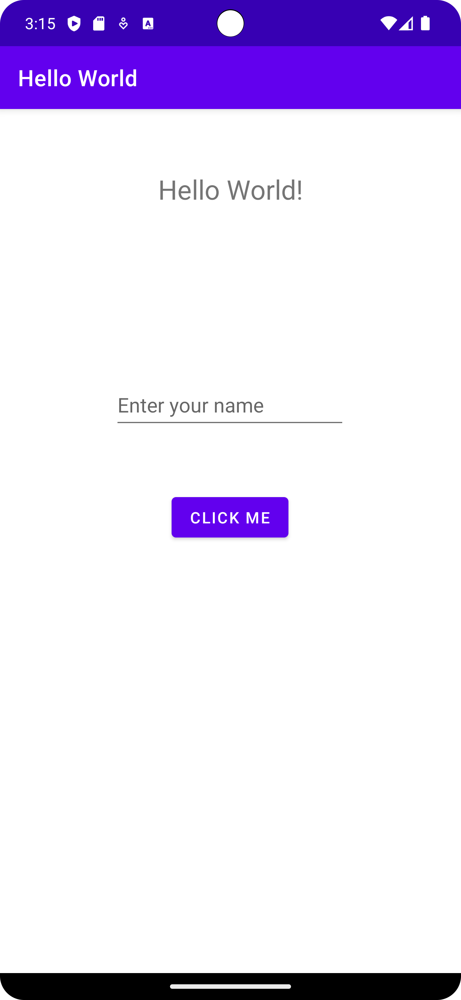

# HelloWorldLab

## About

This is a simple "Hello World" application developed as a part of an educational lab exercise. The app demonstrates the basic functionality of displaying the text "Hello, World!" on the screen.

For more information on README files, check out [GitHub's guide on READMEs](https://help.github.com/en/articles/about-readmes).

## Installation

1. Fork the repository from the original [HelloWorldLab Repository](https://github.com/karlmorris/HelloWorldLab).

2. Clone your forked repository:
    ```bash
    git clone https://github.com/your-username/HelloWorldLab.git
    ```

3. Open the project using your IDE.

## Screenshot



## Usage

After launching the application, you will see a screen displaying the text "Hello, World!".
